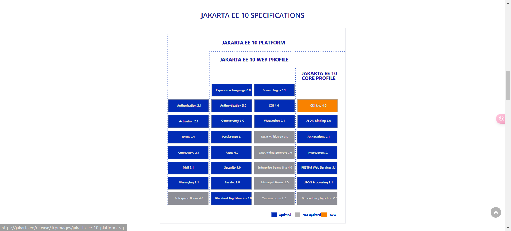
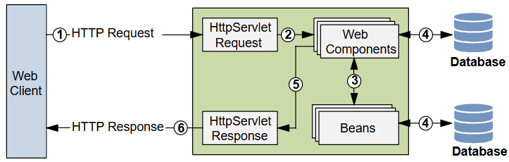
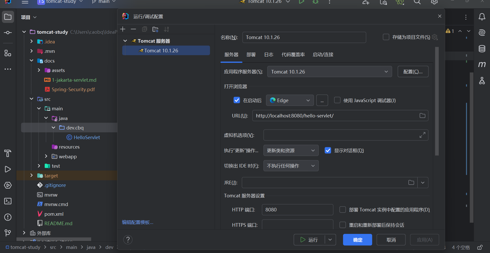
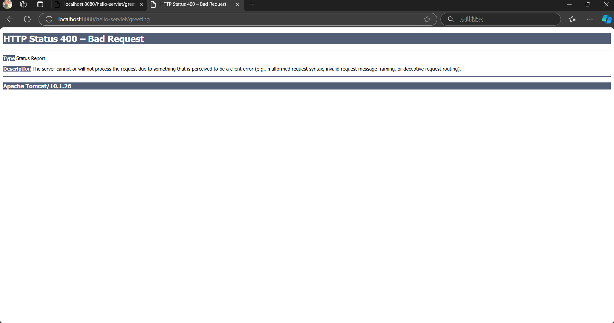
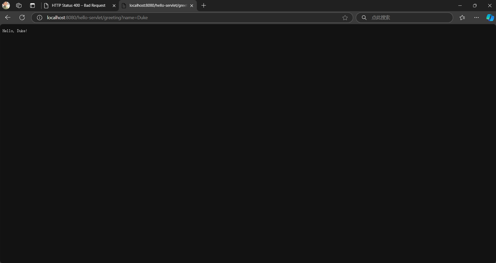
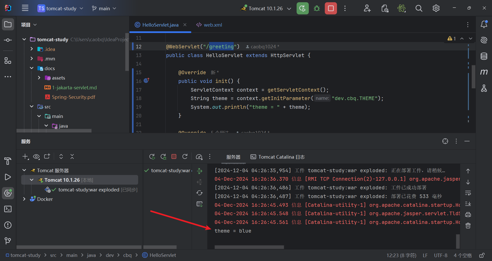
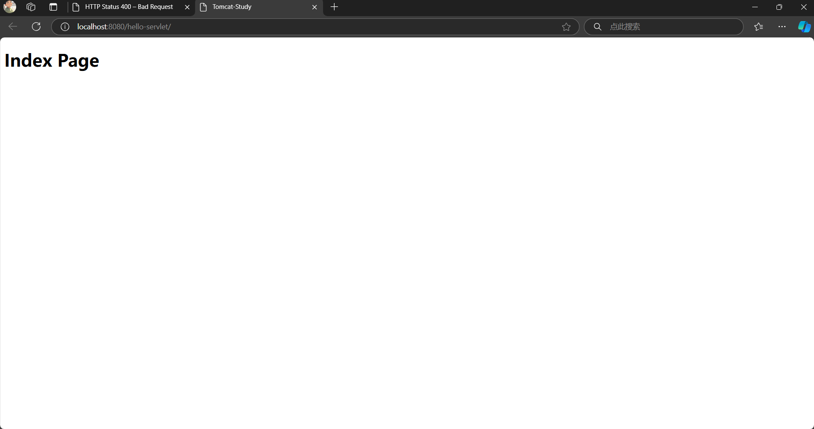
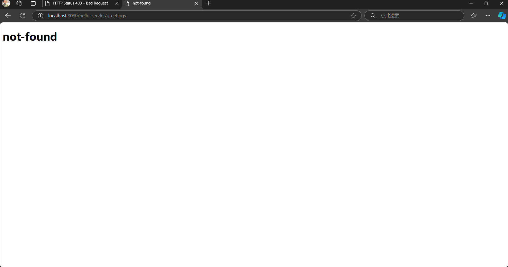
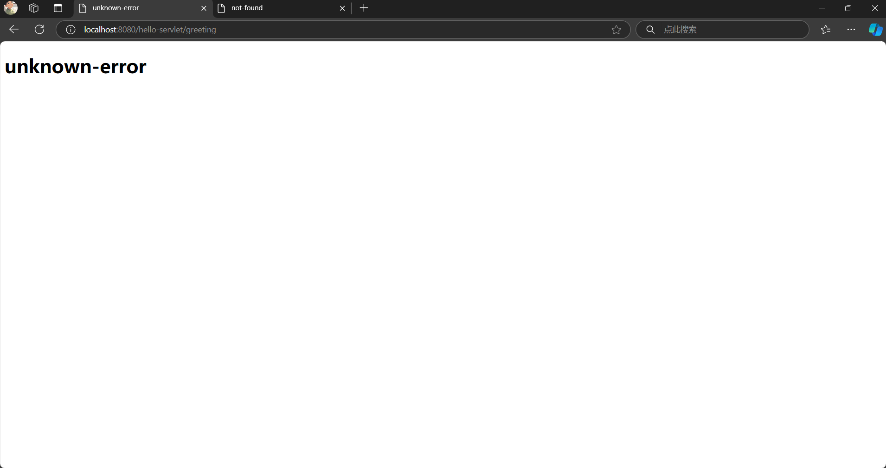

[Jakarta EE 10](https://jakarta.ee/release/10/) is packed with new features for building modernized, simplified, and lightweight cloud native Java
applications. This new innovative community-driven release is designed for organizations looking to start developing new
enterprise Java applications or advancing their existing ones.



The Web Profile allows you to get started developing Java web applications, which typically use Jakarta Servlet API as
corner stone.

# jakarta servlets

> - https://jakarta.ee/learn/docs/jakartaee-tutorial/current/web/webapp/webapp.html

Jakarta Servlet is a corner stone web framework that can act as a presentation-oriented as well as a service-oriented
web application. Jakarta Servlet intends to reduce the boilerplate code needed to convert the HTTP request into a Java
object and to offer a Java object as an HTTP response, and to manage all the lifecycle around them.

Jakarta Servlet can be used to build both presentation and service-oriented web applications. It intends to reduce the boilerplate code needed to convert the HTTP request into a Java object and to offer a Java object as an HTTP response, and to manage all the lifecycle around them.

- Jakarta Faces is a component-based MVC framework that can be executed on a servlet container and act as a presentation-oriented web application. It intends to reduce the boilerplate code needed to collect the request parameters, convert and validate them, update bean properties with them, invoke bean methods, and generate HTML output as response. It is designed to run in servlet and non-servlet environments such as a portlet container.[[1](https://jakarta.ee/learn/docs/jakartaee-tutorial/current/web/webapp/webapp.html#_footnotedef_1)]
- Jakarta REST is a RESTful web service framework that can be executed on a servlet container and act as a service-oriented web application. It intends to reduce the boilerplate code needed to convert the request parameters to a bean and further convert it to the desired response such as JSON or XML. It is designed to run in servlet and non-servlet environments such as a microservice.[[2](https://jakarta.ee/learn/docs/jakartaee-tutorial/current/web/webapp/webapp.html#_footnotedef_2)]

- A servlet container can be part of a Jakarta runtime such as an application server. Certain aspects of web component behavior can be configured when the web application is installed, or deployed, to a servlet container. The configuration information can be specified using annotations or can be maintained in a XML file called a deployment descriptor. A deployment descriptor file must comply to the schema described in the specification associated with the web component. 

> [!TIP]
>
> **When the same configuration is specified using annotations and in a deployment descriptor file, then the configuration in the deployment descriptor file will always have precedence.**

# web application

A web application, also known as a web app, is a software application that runs on one or more web servers. It is typically accessed through a web browser over a network, such as the Internet. The advantage over desktop and mobile applications is being platform-independent, as it can be accessed and used on different devices. Web applications are of the following types:

- *Presentation-oriented*

  A presentation-oriented web application (also called a "website") generates dynamic web pages in response to HTTP requests. The response is usually represented as a HTML document along with assets, such as Cascading Style Sheets (CSS), JavaScript (JS) and images. Presentation-oriented applications are often directly used by humans. Development of presentation-oriented web applications is covered in "Building Web Services with Jakarta XML Web Services" ([available in a previous version of the tutorial](https://jakarta.ee/learn/docs/jakartaee-tutorial/9.1/websvcs/jaxws/jaxws.html#_building_web_services_with_jakarta_xml_web_services)↗) through [Jakarta Servlet Technology](https://jakarta.ee/learn/docs/jakartaee-tutorial/current/web/servlets/servlets.html#_jakarta_servlet_technology)

- *Service-oriented*

  A service-oriented web application (also called a "service") generates dynamic data structures in response to HTTP requests. The response is usually represented as a JSON object or as a XML document or even as plain text. Service-oriented applications are often directly used by presentation-oriented web applications or other service-oriented applications. Development of service-oriented web applications is covered in "Building Web Services with Jakarta XML Web Services" ([available in a previous version of the tutorial](https://jakarta.ee/learn/docs/jakartaee-tutorial/9.1/websvcs/jaxws/jaxws.html#_building_web_services_with_jakarta_xml_web_services)↗)

In the Jakarta EE platform, web applications are represented by web components as seen in [Jakarta Web Application Request Handling](https://jakarta.ee/learn/docs/jakartaee-tutorial/current/web/webapp/webapp.html#_jakarta_web_application_request_handling). A web component can be represented by Jakarta Servlet, Jakarta Faces or Jakarta REST.



1. The client sends an HTTP request to the web server.
2. The web server module that supports Jakarta Servlet-based web components is called a servlet container.
3. The servlet container converts the HTTP request into an `HttpServletRequest` object and prepares the `HttpServletResponse` object.
4. These objects are delivered to a web component, which can interact with beans or a database to generate dynamic content.
5. The web component can fill the `HttpServletResponse` object with the generated dynamic content or can pass the object to another web component to fill it.
6. The servlet container ultimately converts the `HttpServletResponse` object to an HTTP response and the web server returns it to the client.


A Jakarta Servlet-based web application can contain one or more of the following parts:

- One or more web components, which can be represented by Jakarta Servlet, Jakarta Faces or Jakarta REST.
- Assets (also called static resource files), such as Cascading Style Sheets (CSS), JavaScript (JS) and images.
- Dependencies (also called helper libraries, third party libraries, "JARs").
- Deployment descriptor files.

The process for creating, deploying, and executing a Jakarta Servlet-based web application is different from that of Java classes which are packaged and executed as a Java application archive (JAR). It can be summarized as follows:

1. Develop the web component code.
2. Develop the deployment descriptor files, if necessary.
3. Compile the web component code against the libraries of the servlet container and the helper libraries, if any.
4. Package the compiled code along with helper libraries, assets and deployment descriptor files, if any, into a deployable unit, called a web application archive (WAR).
5. Deploy the WAR into a servlet container.
6. Run the web application by accessing a URL that references the web component.

Developing the web component code and deployment descriptor files is covered in the later chapters. Steps 3 through 6 are expanded on in the following sections and illustrated with two web applications, in Hello World–style. The web applications take a name as an HTTP request parameter, generate the greeting and return it as an HTTP response. This chapter discusses the following simple web applications:

- `hello-servlet`, a Jakarta Servlet-based service-oriented web application
- `hello-faces`, a Jakarta Faces-based presentation-oriented web application

They are used to illustrate tasks involved in compiling, packaging, deploying, and running a Jakarta Servlet-based web application that contains web component code.

## requirements

This describes steps 3 through 6. You need Maven and a servlet container.

###  Building The Example Projects

This describes steps 3 and 4. Maven is used to build the example projects. Download and install it as per instructions in [maven.apache.org](https://maven.apache.org/). A Maven WAR project has the following basic structure; not all mentioned resources are required, only the `pom.xml` is required and the rest is optional:

```shell
 |-- src
 |    `-- main
 |         |-- java
 |         |    `-- com
 |         |         `-- example
 |         |              |-- controller
 |         |              |    `-- Servlet.java
 |         |              `-- model
 |         |                   `-- Bean.java
 |         |-- resources
 |         |    `-- com
 |         |         `-- example
 |         |              `-- i18n
 |         |                   |-- text.properties
 |         |                   |-- text_en.properties
 |         |                   `-- text_es.properties
 |         `-- webapp
 |              |-- META-INF
 |              |    `-- MANIFEST.MF
 |              |-- resources
 |              |    |-- css
 |              |    |    `-- style.css
 |              |    |-- img
 |              |    |    `-- logo.svg
 |              |    `-- js
 |              |         `-- script.js
 |              |-- WEB-INF
 |              |    |-- beans.xml
 |              |    |-- faces-config.xml
 |              |    `-- web.xml
 |              |-- favicon.ico
 |              `-- index.xhtml
 `-- pom.xml
```

In a terminal window, go to the folder containing the `pom.xml` and execute the following command:

```shell
mvn install
```

This command compiles and packages the code as described in steps 3 and 4. After the build, the resulting WAR file will be present in the automatically created `target` folder. The WAR file is recognizable by having the `.war` extension.

### Deploying The Example Projects

This describes step 5. You need at least a servlet container in order to deploy a WAR file. The [Jakarta EE Compatible Products](https://jakarta.ee/compatibility/) page lists several Jakarta runtimes having a servlet container. At least those compatible with "Web Profile" and "Jakarta EE Platform" have a servlet container. Examples are Eclipse GlassFish, IBM Open Liberty and Red Hat WildFly. They are available in both "Web Profile" and "Jakarta EE Platform" flavors.

There are also partial Jakarta runtimes having a servlet container. Partial as in, they do not fully implement "Web Profile". **One example is Apache Tomcat**. It does implement Jakarta Servlet, Jakarta Pages, Jakarta Expression Language, Jakarta WebSocket, and Jakarta Security. But it does not implement Jakarta REST, Jakarta CDI, Jakarta Faces nor Jakarta Tags.

Deploying a WAR file is generally done by placing the WAR file in the runtime-specific folder dedicated for (automatic) deployments. The exact location depends on the runtime used:

- In case of Eclipse GlassFish that’s the `glassfish/domains/domain1/autodeploy` folder.
- In case of IBM Open Liberty that’s the `config/dropins` folder.
- In case of Red Hat WildFly that’s the `standalone/deployments` folder.
- In case of Apache Tomcat that’s the `webapps` folder.

Refer to the documentation for your runtime for the most recent information.

> Undeploying a WAR file is generally done by removing the WAR file from the folder.

Some runtimes offer a graphical user interface (GUI) for administration tasks such as selecting, uploading and a deploying a WAR file. For this you’ll need to start the server first and then open a specific URL in your web browser representing the location of the admin console:

- In case of Eclipse GlassFish that’s reachable via `http://localhost:4848`
- In case of IBM Open Liberty that’s reachable via `https://localhost:9443`
- In case of Red Hat WildFly that’s reachable via `http://localhost:9990`
- In case of Apache Tomcat that’s reachable via `http://localhost:8080/manager`

Refer to the documentation for your runtime for the most recent information.

You can also use an integrated development environment (IDE) to manage runtimes and deployments. Examples are Eclipse IDE, IntelliJ IDEA and Apache NetBeans. They can also automatically build the projects for you.

### Running The Example Projects 

This describes step 6. You’ll need to start the server first and then open a specific URL in your web browser representing the location of the WAR deployment. By default, the URL has the following form:

```shell
http(s)://host:port/context-path
```

By default, the `context-path` is represented by the base file name of the WAR file, without the extension. If there is no web component listening on the root of the context path, then you could face an HTTP 404 'Not Found' error page. In that case you would need to use a more specific URL, depending on the configuration of the desired web component. This will be detailed in [Mapping URLs to Web Components](https://jakarta.ee/learn/docs/jakartaee-tutorial/current/web/webapp/webapp.html#_mapping_urls_to_web_components).

### summary

we select:

- servlet container: tomcat 10.1.26
- IDE: IntelliJ IDEA 2024.1.4 (Ultimate Edition)

## hello-servlet

The `hello-servlet` application is a web application that uses Jakarta Servlet take a name as an HTTP request parameter, generate the greeting and return it as an HTTP response. As a service-oriented web application, the response is in this minimal example represented as plain text.

The source code for this application is in the `*jakartaee-examples*/tutorial/web/servlet/hello-servlet/` directory.



### The Servlet

> [!NOTE]
>
> **In a typical Jakarta Servlet-based web application, the class must extend `jakarta.servlet.http.HttpServlet` and override one of the `doXxx()` methods where `Xxx` represents the HTTP method of interest. Such a class is in the Jakarta Servlet world called a *Servlet*.**

For this Hello World web application, the `src/main/java/jakarta/tutorial/web/servlet/Greeting.java` servlet listens on HTTP GET requests and extracts the `name` request parameter as input and creates the `greeting` as output.

```java
package jakarta.tutorial.web.servlet;

import java.io.IOException;

import jakarta.servlet.ServletException;
import jakarta.servlet.annotation.WebServlet;
import jakarta.servlet.http.HttpServlet;
import jakarta.servlet.http.HttpServletRequest;
import jakarta.servlet.http.HttpServletResponse;

@WebServlet("/greeting")
public class HelloServlet extends HttpServlet {

    @Override
    public void doGet
        (HttpServletRequest request, HttpServletResponse response)
            throws ServletException, IOException
    {
        var name = request.getParameter("name");

        if (name == null || name.isBlank()) {
            response.sendError(HttpServletResponse.SC_BAD_REQUEST);
            return;
        }

        var greeting = "Hello, " + name + "!";

        response.setContentType("text/plain");
        response.getWriter().write(greeting);
    }
}
```

### Mapping URLs to Web Components

When the servlet container receives a request, it must determine which web component should handle the request. The servlet container does so by mapping the URL contained in the request to a web component. A URL contains the context path and, optionally, a URL pattern:

```shell
http(s)://host:port/context-path[/url-pattern]
```

You can set the URL pattern for a servlet by using the `@WebServlet` annotation in the servlet source file or by using `<servlet-mapping>` entry in the Jakarta Servlet deployment descriptor file, the `src/main/webapp/WEB-INF/web.xml`. In the `Greeting` servlet example the `@WebServlet` annotation indicates that the URL pattern is `/greeting`. Therefore, when the servlet is deployed to a local server listening on `http://localhost:8080` with the context path set to `hello-servlet`, it is accessed with the following URL:

```shell
http://localhost:8080/hello-servlet/greeting
```



The Hello World example will return an HTTP 400 error as response indicating a 'Bad Request'. When specifying the name as a request parameter in the following URL:

```shell
http://localhost:8080/hello-servlet/greeting?name=Duke
```

Then it will return the response `Hello, Duke!`.



## (OPT)hello-faces

The `hello-faces` application is a web application that uses Jakarta Faces take a name as an HTTP request parameter, generate the greeting and return it as an HTTP response. As a presentation-oriented web application, the response is represented as a HTML document.

The source code for this application is in the `*jakartaee-examples*/tutorial/web/faces/hello-faces/` directory.

Jakarta Faces is a component-based MVC framework that provides its own servlet as controller (the "C" part of MVC), the `FacesServlet`. The model and the view are usually provided by you, the web developer.

###  The Model

In a typical Jakarta Faces application, the model (the "M" part of MVC) is represented by a bean class. Such a bean class is in the Jakarta Faces world called a *Backing Bean*.

For this Hello World web application, the `src/main/java/jakarta/tutorial/web/faces/Hello.java` backing bean defines a `name` property along with a getter and setter, a `greeting` property along with a getter, and a `submit` action method which creates the `greeting` as output-based on `name` as input.

```java
package jakarta.tutorial.web.faces;

import jakarta.enterprise.context.RequestScoped;
import jakarta.inject.Named;

@Named
@RequestScoped
public class Hello {

    private String name;
    private String greeting;

    public void submit() {
        greeting = "Hello, " + name + "!";
    }

    public String getName() {
        return name;
    }

    public void setName(String name) {
        this.name = name;
    }

    public String getGreeting() {
        return greeting;
    }
}
```

> [!TIP]
>
> **Note that a getter is required for output and that a setter is only required for input.**

In a typical Jakarta Faces application, CDI is used to manage the backing beans. We’ll briefly go through the CDI annotations that are used here:

- `@Named` — gives the backing bean a managed bean name, which is primarily used to reference it in Expression Language (EL). Without any attributes this defaults to the simple class name with the first letter in lowercase. This backing bean will thus be available as a managed bean via `#{hello}` in EL.
- `@RequestScoped` — gives the backing bean a managed bean scope, which essentially represents its lifespan. In this case that lifespan is the duration of an HTTP request. When the HTTP request ends, then the managed bean instance is destroyed.

###  The View

In a typical Jakarta Faces application, the view (the "V" part of MVC) is represented by a XHTML file. Such a XHTML file is in the Jakarta Faces world called a *Facelets File* or just *Facelet*. In Jakarta Faces, the view technology is pluggable and Facelets is used as the default view technology. XHTML markup is being used because it allows the framework to easily use a XML parser to find Jakarta Faces tags of interest and to generate HTML output.

For this Hello World web application, the `src/main/webapp/hello.xhtml` Facelet defines a form with an input field, a command button and an output field.

```xml
<!DOCTYPE html>
<html lang="en"
      xmlns:f="jakarta.faces.core"
      xmlns:h="jakarta.faces.html">
    <h:head>
        <title>Jakarta Faces Hello World</title>
    </h:head>
    <h:body>
        <h1>Hello, what's your name?</h1>
        <h:form>
            <h:inputText value="#{hello.name}" required="true" />
            <h:commandButton value="Submit" action="#{hello.submit}">
                <f:ajax execute="@form" render=":greeting" />
            </h:commandButton>
            <h:messages />
        </h:form>
        <h:outputText id="greeting" value="#{hello.greeting}" />
    </h:body>
</html>
```

We’ll briefly go through the Jakarta Faces-specific XHTML tags that are used here.

- `<h:head>` — generates the HTML `<head>`. It gives Jakarta Faces the opportunity to automatically include any necessary JS and CSS files in the generated HTML head.
- `<h:body>` — generates the HTML `<body>`. It gives Jakarta Faces the opportunity to automatically include any necessary JS files in the end of the generated HTML body.
- `<h:form>` — generates the HTML `<form>`. It gives Jakarta Faces the opportunity to automatically include a hidden field representing the view state.
- `<h:inputText>` — generates the HTML `<input>`. It gives Jakarta Faces the opportunity to automatically get and set the value as a managed bean property specified in the `value` attribute, as well as to perform any conversion and validation on it.
- `<h:commandButton>` — generates the HTML `<input type="submit">`. It gives Jakarta Faces the opportunity to automatically invoke the backing bean method specified in the `action` attribute.
- `<h:messages>` — generates the HTML `<ul>` or `<div>` or `<table>` depending on state and configuration. It gives you the opportunity to declare the place where any conversion and validation messages will be displayed.
- `<f:ajax>` — generates the necessary JavaScript code for Ajax behavior. If gives you the opportunity to configure the form submit to be performed asynchronously using Ajax.
- `<h:outputText>` — generates the HTML `<span>`. This is the one being updated on completion of the Ajax submit and it will display the current value of the managed bean property specified in the `value` attribute.

The `<h:…>` tags define standard HTML components. The `<f:…>` tags define behavior.

The input value is via EL value expression `#{hello.name}` connected to the `name` property of the `Hello` backing bean via its getter and setter. The output value is via EL value expression `#{hello.greeting}` connected to the `greeting` property of the `Hello` backing bean via its getter. The command button is via EL method expression `#{hello.submit}` connected to the `submit` method of the `Hello` backing bean.

Note that for EL value expressions the physical field representing the property doesn’t need to have exactly the same name nor that it needs to exist at all. EL only looks for the getter and setter methods, not for the field.

###  The Controller

In a typical Jakarta Faces application, the controller (the "C" part of MVC) is registered in the Jakarta Servlet deployment descriptor file, the `src/main/webapp/WEB-INF/web.xml`.

```xml
<?xml version="1.0" encoding="UTF-8"?>
<web-app xmlns="https://jakarta.ee/xml/ns/jakartaee"
         xmlns:xsi="http://www.w3.org/2001/XMLSchema-instance"
         xsi:schemaLocation="https://jakarta.ee/xml/ns/jakartaee https://jakarta.ee/xml/ns/jakartaee/web-app_6_0.xsd"
         version="6.0">
    <servlet>
        <servlet-name>facesServlet</servlet-name>
        <servlet-class>jakarta.faces.webapp.FacesServlet</servlet-class>
        <load-on-startup>1</load-on-startup>
    </servlet>
    <servlet-mapping>
        <servlet-name>facesServlet</servlet-name>
        <url-pattern>*.xhtml</url-pattern>
    </servlet-mapping>
</web-app>
```

It basically instructs the servlet container to create an instance of `jakarta.faces.webapp.FacesServlet` as `facesServlet` during startup and to execute it when the URL pattern of the HTTP request matches `*.xhtml`.

In a web browser, open the following URL:

```shell
http://localhost:8080/hello-faces/hello.xhtml
```

It will show a web page with a form asking for your name. Enter your name in the input field of the form, for example 'Duke', and click Submit. This will show the text `Hello, Duke!` below the form.

##  Preparing Deployment Descriptor

The Jakarta Servlet deployment descriptor is represented by the `WEB-INF/web.xml` file which is in a Maven-based project placed in `src/main/webapp` folder. It must be a XML file with a `<web-app>` root element conform the `web-app_X_Y.xsd` XML schema of the https://jakarta.ee/xml/ns/jakartaee namespace.

```xml
<?xml version="1.0" encoding="UTF-8"?>
<web-app xmlns="https://jakarta.ee/xml/ns/jakartaee"
         xmlns:xsi="http://www.w3.org/2001/XMLSchema-instance"
         xsi:schemaLocation="https://jakarta.ee/xml/ns/jakartaee https://jakarta.ee/xml/ns/jakartaee/web-app_6_0.xsd"
         version="6.0">
       <!-- Put configuration here -->
</web-app>
```

### Setting Context Parameters 

> [!NOTE]
>
> **The web components in a web application share an object that represents their application context, the `jakarta.servlet.ServletContext`.** 

You define context-wide initialization parameters in the `web.xml` file.

```xml
<context-param>
    <param-name>dev.cbq.THEME</param-name>
    <param-value>blue</param-value>
</context-param>
```

You can obtain them in application code via `getInitParameter(String name)` method of the `ServletContext` instance.

```java
@WebServlet("/greeting")
public class HelloServlet extends HttpServlet {

    @Override
    public void init() {
        ServletContext context = getServletContext();
        String theme = context.getInitParameter("dev.cbq.THEME");
        System.out.println("theme = " + theme);
    }
}
```



These context parameters can be used to configure (default) application-wide variables, such as the web application’s project stage, the path to save uploaded files, the path to a more specific configuration file, the maximum size of a cache, the expiration time of a cacheable resource, the name of the tenant/theme/scheme, or even helper library specific parameters, etcetera, but never passwords. It are those variables which you’d normally define as constants in a Java class, but then without the need to recompile Java classes whenever you’d like to edit them.

###  Declaring Welcome Files

The welcome files mechanism allows you to specify a list of files that the servlet container can return as a default resource when any folder is requested which does not map to an existing web component. For example, suppose that you define two welcome files `index.xhtml` and `index.html`. So, if for example the `/` folder is requested, and it does not map to a web component, then it’ll search for `/index.xhtml` and `/index.html` files and return the first found one. Or if there is none, then the servlet container will continue to perform the default behavior, which is usually displaying an HTTP 404 error page. Note that this also applies to sub folders, so if for example the `/foo` folder is requested, then it’ll search for `/foo/index.xhtml` and `/foo/index.html` files and return the first found one. You specify welcome files in the `web.xml` file.

```xml
<welcome-file-list>
    <welcome-file>index.html</welcome-file>
</welcome-file-list>
```



A specified welcome file must not have a leading slash (`/`) as it is interpreted independently of the requested folder.

###  Mapping Errors to Error Pages

When an error occurs during execution of a web application, you can have the application display a specific error page according to the type of error. In particular, you can specify a mapping between the status code returned in an HTTP response or a Java programming language exception returned by any web component and any type of error page. You specify error pages in the `web.xml` file.

```xml
<error-page>
    <error-code>401</error-code>
    <location>/WEB-INF/error-pages/unauthorized.html</location>
</error-page>
<error-page>
    <error-code>403</error-code>
    <location>/WEB-INF/error-pages/unauthenticated.html</location>
</error-page>
<error-page>
    <error-code>404</error-code>
    <location>/WEB-INF/error-pages/not-found.html</location>
</error-page>
<error-page>
    <error-code>500</error-code>
    <location>/WEB-INF/error-pages/general-error.html</location>
</error-page>
<error-page>
    <exception-type>jakarta.faces.application.ViewExpiredException</exception-type>
    <location>/WEB-INF/error-pages/view-expired.html</location>
</error-page>
<error-page>
    <!-- No error-code or exception-type, i.e. this will match any other HTTP status than defined above -->
    <location>/WEB-INF/error-pages/unknown-error.html</location>
</error-page>
```





A specified location must have a leading slash (`/`) as it is interpreted as an absolute path within the context of the web application deployment. The error page being placed in `/WEB-INF` folder is not technically required, but it is the best practice as it will prevent the client from being able to request or even bookmark them individually.

###  Declaring Resource References

If your web application uses external resources, such as data sources or mail sessions, then you can specify it in `web.xml` and use the `@javax.annotation.Resource` annotation to inject it into a container-managed object of your web application.

The `@Resource` annotation can be specified on a class, a method, or a field. The container is responsible for instantiating and injecting references to resources declared by the `@Resource` annotation in container-managed objects and mapping it to the proper JNDI resources.

Container-managed objects are primarily those objects which you do not explicitly instantiate yourself as in `new ContainerManagedObject()` but basically let the container do. For example CDI managed beans in case of a CDI container, and web components in case of a servlet container. CDI managed beans are recognizable as classes having a CDI scope annotation such as `@RequestScoped` or `@Dependent`. Web components are recognizable as classes that extend or implement a class or interface of the `jakarta.servlet.` **package, and are registered via an annotation of the `jakarta.servlet.annotation.`** package or an entry in the `web.xml` file.

### Declaring Data Source References 

If your web application uses data sources, then you can specify it in `web.xml` and use the `@Resource` annotation to inject it into a container-managed object of your web application as a `javax.sql.DataSource` instance. The below example specifies a H2 data source listening on JNDI resource name of `java:global/YourDataSourceName`, using the `org.h2.jdbcx.JdbcDataSource` as `javax.sql.DataSource` implementation.

```xml
<data-source>
    <name>java:global/YourDataSourceName</name>
    <class-name>org.h2.jdbcx.JdbcDataSource</class-name>
    <url>jdbc:h2:mem:test</url>
</data-source>
```

If you have only one data source reference specified, then you can inject it as a `@Resource` of `javax.sql.DataSource` type without an explicit JNDI resource name.

```java
@Resource
private DataSource dataSource;

public Connection getConnection() {
    return dataSource.getConnection();
}
```

If you have more than one data source reference specified, then you need to explicitly specify the JNDI resource name.

```java
@Resource(name="java:global/YourDataSourceName")
private DataSource dataSource;

public Connection getConnection() {
    return dataSource.getConnection();
}
```

> [!TIP]
>
> **Do note that `javax.sql.DataSource` is not part of Jakarta EE but of Java SE and hence it has still the `javax` as root package.**

###  Declaring Mail Session References

If your web application uses mail sessions, then you can specify it in `web.xml` and use the `@Resource` annotation to inject it into a container-managed object of your web application as a `jakarta.mail.Session` instance. The below example specifies a SMTP mail session listening on JNDI name of `java:global/YourMailSessionName`, using the `smtp.example.com` host to create `jakarta.mail.Session` for.

```xml
<mail-session>
    <name>java:global/YourMailSessionName</name>
    <host>smtp.example.com</host>
    <user>user@example.com</user>
</mail-session>
```

If you have only one mail session reference specified, then you can inject it as a `@Resource` of `jakarta.mail.Session` type without an explicit JNDI resource name.

```java
@Resource
private Session session;

public void sendMail(YourMail mail) throws MessagingException {
    Message message = new MimeMessage(session);
    // ...
}
```

If you have more than one mail session reference specified, then you need to explicitly specify the JNDI resource name.

```java
@Resource(name="java:global/YourMailSessionName")
private Session session;

public void sendMail(YourMail mail) throws MessagingException {
    Message message = new MimeMessage(session);
    // ...
}
```

# jakarta servlet


