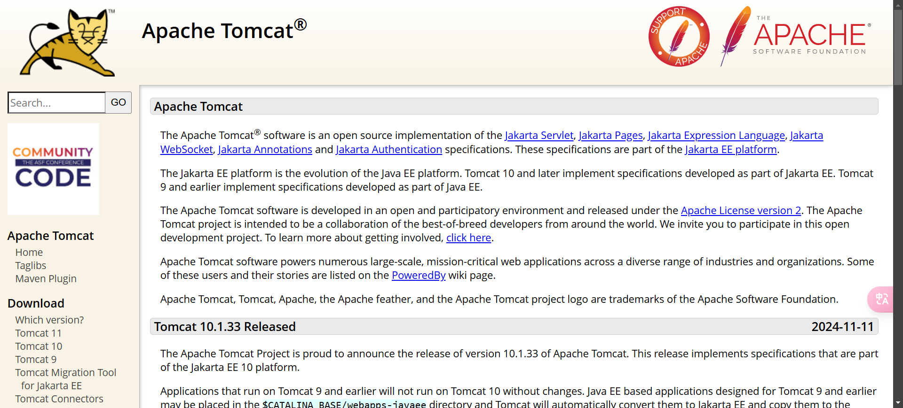
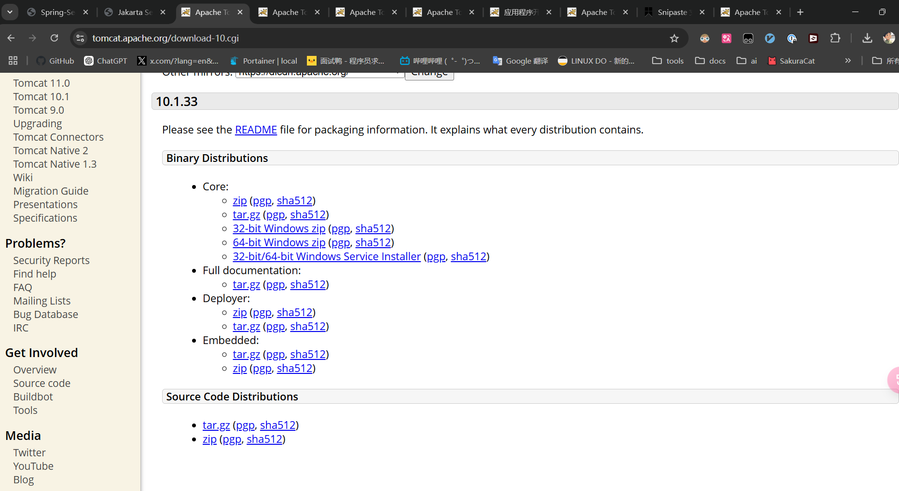
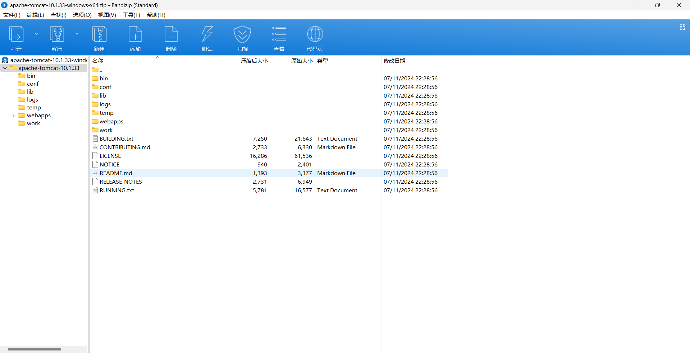
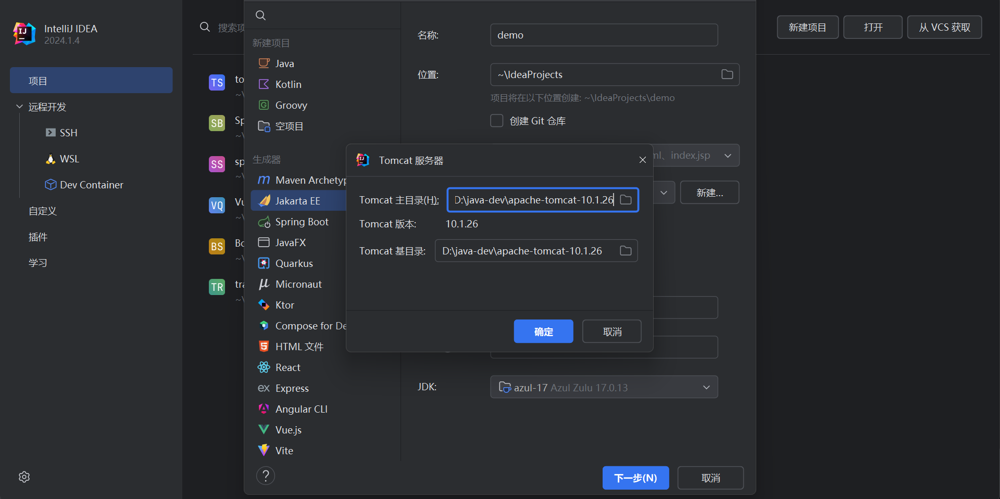
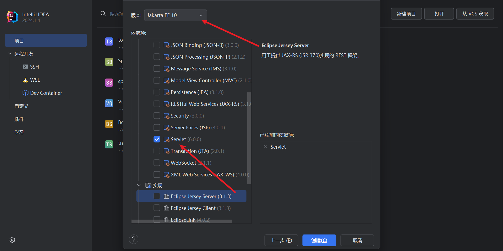

# Apache Tomcat

The Apache Tomcat® software is an open source implementation of the [Jakarta Servlet](https://projects.eclipse.org/projects/ee4j.servlet), [Jakarta Pages](https://projects.eclipse.org/projects/ee4j.jsp), [Jakarta Expression Language](https://projects.eclipse.org/projects/ee4j.el), [Jakarta WebSocket](https://projects.eclipse.org/projects/ee4j.websocket), [Jakarta Annotations](https://projects.eclipse.org/projects/ee4j.ca) and [Jakarta Authentication](https://projects.eclipse.org/projects/ee4j.authentication) specifications. These specifications are part of the [Jakarta EE platform](https://projects.eclipse.org/projects/ee4j.jakartaee-platform).

# Wich Version?

- https://tomcat.apache.org/whichversion.html

Apache Tomcat® is an open source software implementation of a subset of the Jakarta EE (formally Java EE) technologies. Different versions of Apache Tomcat are available for different versions of the specifications. The mapping between [the specifications](https://cwiki.apache.org/confluence/display/TOMCAT/Specifications) and the respective Apache Tomcat versions is:

## Currently Supported Versions

| **Servlet Spec** | **JSP Spec** | **EL Spec** | **WebSocket Spec** | **Authentication Spec (JASPIC)** | **Apache Tomcat Version** | **Latest Released Version** | **Supported Java Versions** |
| :--------------- | :----------- | :---------- | :----------------- | :------------------------------- | :------------------------ | :-------------------------- | :-------------------------- |
| 6.1              | 4.0          | 6.0         | 2.2                | 3.1                              | 11.0.x                    | 11.0.1                      | 17 and later                |
| 6.0              | 3.1          | 5.0         | 2.1                | 3.0                              | 10.1.x                    | 10.1.33                     | 11 and later                |
| 4.0              | 2.3          | 3.0         | 1.1                | 1.1                              | 9.0.x                     | 9.0.97                      | 8 and later                 |

## Unsupported Version

These versions of Apache Tomcat have reached end-of-life and users are encouraged to upgrade to a supported version.

| **Servlet Spec** | **JSP Spec** | **EL Spec** | **WebSocket Spec** | **Authentication Spec (JASPIC)** | **Apache Tomcat Version**                                   | **Final[1](https://tomcat.apache.org/whichversion.html#final_release_note) Released Version** | **Supported Java Versions**             | EOL Date                                                     |
| :--------------- | :----------- | :---------- | :----------------- | :------------------------------- | :---------------------------------------------------------- | :----------------------------------------------------------- | :-------------------------------------- | :----------------------------------------------------------- |
| 5.0              | 3.0          | 4.0         | 2.0                | 2.0                              | 10.0.x (superseded)                                         | 10.0.27 (superseded)                                         | 8 and later                             | [2022-10-31](https://tomcat.apache.org/tomcat-10.0-eol.html) |
| 3.1              | 2.3          | 3.0         | 1.1                | 1.1                              | 8.5.x ([EOL](https://tomcat.apache.org/tomcat-85-eol.html)) | 8.5.100 ([EOL](https://tomcat.apache.org/tomcat-85-eol.html)) | 7 and later                             | [2024-03-31](https://tomcat.apache.org/tomcat-85-eol.html)   |
| 3.1              | 2.3          | 3.0         | 1.1                | N/A                              | 8.0.x (superseded)                                          | 8.0.53 (superseded)                                          | 7 and later                             | [2018-06-30](https://tomcat.apache.org/tomcat-80-eol.html)   |
| 3.0              | 2.2          | 2.2         | 1.1                | N/A                              | 7.0.x (archived)                                            | 7.0.109 (archived)                                           | 6 and later (7 and later for WebSocket) | [2021-03-31](https://tomcat.apache.org/tomcat-70-eol.html)   |
| 2.5              | 2.1          | 2.1         | N/A                | N/A                              | 6.0.x (archived)                                            | 6.0.53 (archived)                                            | 5 and later                             | [2016-12-31](https://tomcat.apache.org/tomcat-60-eol.html)   |
| 2.4              | 2.0          | N/A         | N/A                | N/A                              | 5.5.x (archived)                                            | 5.5.36 (archived)                                            | 1.4 and later                           | [2012-09-31](https://tomcat.apache.org/tomcat-55-eol.html)   |
| 2.3              | 1.2          | N/A         | N/A                | N/A                              | 4.1.x (archived)                                            | 4.1.40 (archived)                                            | 1.3 and later                           | [2009-06-25](https://lists.apache.org/thread/v1ccn429s9lh32ypvwwhxo26zhh1965c) |
| 2.2              | 1.1          | N/A         | N/A                | N/A                              | 3.3.x (archived)                                            | 3.3.2 (archived)                                             | 1.1 and later                           | [2004-03-09](https://lists.apache.org/thread/nw4vpbwgrn480gsvn06f4qj4yhoo89v7) |

## Supported Version Details 

- **Apache Tomcat 11.0.x** is the current focus of development. It builds on Tomcat 10.1.x and implements the **Servlet 6.1**, **JSP 4.0**, **EL 6.0**, **WebSocket 2.2** and **Authentication 3.1** specifications (the versions required by Jakarta EE 11 platform).
- **Apache Tomcat 10.1.x** builds on Tomcat 10.0.x and implements the **Servlet 6.0**, **JSP 3.1**, **EL 5.0**, **WebSocket 2.1** and **Authentication 3.0** specifications (the versions required by Jakarta EE 10 platform).
- **Apache Tomcat 9.x** builds on Tomcat 8.0.x and 8.5.x and implements the **Servlet 4.0**, **JSP 2.3**, **EL 3.0**, **WebSocket 1.1** and **JASPIC 1.1** specifications (the versions required by Java EE 8 platform). In addition to this, it includes the following significant improvements:

## Alpha Beta Stable

When voting for a release, reviewers specify the stability level that they consider the release has reached. Initial releases of a new major version typically process from Alpha, through Beta to Stable over a period of several months. However, the Stable level is only available once the Java specifications the release implements have been finalised.

> [!TIP]
>
>  This means a release that in all other respects is considered stable, may still be labelled as Beta if the specifications are not final.

The download pages will always show the latest stable release and any newer Alpha or Beta release if one exists. Alpha and beta releases are always clearly marked on the download pages.

Stability is a subjective judgement and you should always read carefully the release notes for any version you intend to make use of. If you are an early adopter of a release, we would love to hear your opinion about its stability as part of the vote: it takes place on the [development mailing list](https://tomcat.apache.org/lists.html).

- **Alpha** releases may contain large amounts of untested/missing functionality required by the specification and/or significant bugs and are not expected to run stably for any length of time.
- **Beta** releases may contain some untested functionality and/or a number of relatively minor bugs. Beta releases are not expected to run stably.
- **Stable** releases may contain a small number of relatively minor bugs. Stable releases are intended for production use and are expected to run stably for extended periods of time.

# Install

**Apache Tomcat 10.1.x** builds on Tomcat 10.0.x and implements the **Servlet 6.0**, **JSP 3.1**, **EL 5.0**, **WebSocket 2.1** and **Authentication 3.0** specifications (the versions required by Jakarta EE 10 platform). so we select it to study (Jakarta EE 10)

- https://tomcat.apache.org/download-10.cgi

## Windows

- https://dlcdn.apache.org/tomcat/tomcat-10/v10.1.33/bin/apache-tomcat-10.1.33-windows-x64.zip

These are some of the key tomcat directories:

- **/bin** - Startup, shutdown, and other scripts. The `*.sh` files (for Unix systems) are functional duplicates of the `*.bat` files (for Windows systems). Since the Win32 command-line lacks certain functionality, there are some additional files in here.

- **/conf** - Configuration files and related DTDs. The most important file in here is server.xml. It is the main configuration file for the container.

- **/logs** - Log files are here by default.

- **/webapps** - This is where your webapps go.

> [!NOTE]
>
> show more info https://tomcat.apache.org/tomcat-10.1-doc/setup.html

## Linux

TODO

## Docker

TODO

# A word on Contexts

In talking about deployment of web applications, the concept of a *Context* is required to be understood. A Context is what Tomcat calls a web application.

In order to configure a Context within Tomcat a *Context Descriptor* is required. A Context Descriptor is simply an XML file that contains Tomcat related configuration for a Context, e.g naming resources or session manager configuration. In earlier versions of Tomcat the content of a Context Descriptor configuration was often stored within Tomcat's primary configuration file *server.xml* but this is now discouraged (although it currently still works).

Context Descriptors not only help Tomcat to know how to configure Contexts but other tools such as the Tomcat Manager and TCD often use these Context Descriptors to perform their roles properly.

The locations for Context Descriptors are:

- $CATALINA_BASE/conf/[enginename]/[hostname]/[webappname].xml
- $CATALINA_BASE/webapps/[webappname]/META-INF/context.xml

Files in (1) are named [webappname].xml but files in (2) are named context.xml. If a Context Descriptor is not provided for a Context, Tomcat configures the Context using default values.

# Deploy

Deployment is the term used for the process of installing a web application (either a 3rd party WAR or your own custom web application) into the Tomcat server.

Web application deployment may be accomplished in a number of ways within the Tomcat server.

- Statically; the web application is setup before Tomcat is started
- Dynamically; by directly manipulating already deployed web applications (relying on *auto-deployment* feature) or remotely by using the Tomcat Manager web application

The [Tomcat Manager](https://tomcat.apache.org/tomcat-10.1-doc/manager-howto.html) is a web application that can be used interactively (via HTML GUI) or programmatically (via URL-based API) to deploy and manage web applications.

There are a number of ways to perform deployment that rely on the Manager web application. Apache Tomcat provides tasks for Apache Ant build tool. [Apache Tomcat Maven Plugin](https://tomcat.apache.org/maven-plugin.html) project provides integration with Apache Maven. There is also a tool called the Client Deployer, which can be used from a command line and provides additional functionality such as compiling and validating web applications as well as packaging web application into web application resource (WAR) files.

## Deployment on Tomcat startup

If you are not interested in using the Tomcat Manager, or TCD, then you'll need to deploy your web applications statically to Tomcat, followed by a Tomcat startup. The location you deploy web applications to for this type of deployment is called the `appBase` which is specified per Host. You either copy a so-called *exploded web application*, i.e non-compressed, to this location, or a compressed web application resource .WAR file.

The web applications present in the location specified by the Host's (default Host is "localhost") `appBase` attribute (default appBase is "$CATALINA_BASE/webapps") will be deployed on Tomcat startup only if the Host's `deployOnStartup` attribute is "true".

The following deployment sequence will occur on Tomcat startup in that case:

1. Any Context Descriptors will be deployed first.
2. Exploded web applications not referenced by any Context Descriptor will then be deployed. If they have an associated .WAR file in the appBase and it is newer than the exploded web application, the exploded directory will be removed and the webapp will be redeployed from the .WAR
3. .WAR files will be deployed

## Deploying on a running Tomcat server 

It is possible to deploy web applications to a running Tomcat server.

If the Host `autoDeploy` attribute is "true", the Host will attempt to deploy and update web applications dynamically, as needed, for example if a new .WAR is dropped into the `appBase`. For this to work, the Host needs to have background processing enabled which is the default configuration.

`autoDeploy` set to "true" and a running Tomcat allows for:

1. Deployment of .WAR files copied into the Host `appBase`.
2. Deployment of exploded web applications which are copied into the Host `appBase`.
3. Re-deployment of a web application which has already been deployed from a .WAR when the new .WAR is provided. In this case the exploded web application is removed, and the .WAR is expanded again. Note that the explosion will not occur if the Host is configured so that .WARs are not exploded with a `unpackWARs` attribute set to "false", in which case the web application will be simply redeployed as a compressed archive.
4. Re-loading of a web application if the /WEB-INF/web.xml file (or any other resource defined as a WatchedResource) is updated.
5. Re-deployment of a web application if the Context Descriptor file from which the web application has been deployed is updated.
6. Re-deployment of dependent web applications if the global or per-host Context Descriptor file used by the web application is updated.
7. Re-deployment of a web application if a Context Descriptor file (with a filename corresponding to the Context path of the previously deployed web application) is added to the `$CATALINA_BASE/conf/[enginename]/[hostname]/` directory.
8. Undeployment of a web application if its document base (docBase) is deleted. Note that on Windows, this assumes that anti-locking features (see Context configuration) are enabled, otherwise it is not possible to delete the resources of a running web application.

> [!TIP]
>
> Note that web application reloading can also be configured in the loader, in which case loaded classes will be tracked for changes.

## Deploying using the Tomcat Manager 

The Tomcat Manager is covered in its [own manual page](https://tomcat.apache.org/tomcat-10.1-doc/manager-howto.html).

# Setup in IntelliJ IDEA

