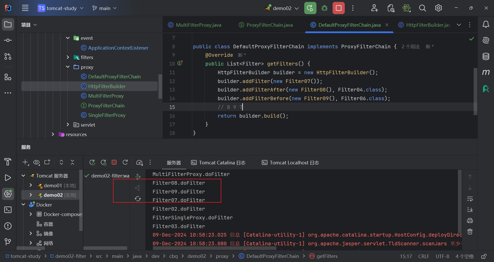

# filter

- https://jakarta.ee/learn/docs/jakartaee-tutorial/current/web/servlets/servlets.html#_filtering_requests_and_responses

# Lifecycle

```java
@WebFilter(urlPatterns = "/*", initParams = {
        @WebInitParam(name = "k1", value = "v1"),
        @WebInitParam(name = "k2", value = "v2")
})
public class HelloFilter extends HttpFilter {

    /**
     * ! doFilter 仅当该 Filter 匹配到请求时执行 | FilterChain 具有放行机制 [规范保证]
     * ! 注意: 若开发者自定义实现 FilterChain 则无法保证放行机制 (其由 servlet 容器管理 如 tomcat)
     * @param req a {@link HttpServletRequest} object that contains the request the client has made of the filter
     *
     * @param res a {@link HttpServletResponse} object that contains the response the filter sends to the client
     *
     * @param chain the <code>FilterChain</code> for invoking the next filter or the resource
     *
     * @throws ServletException ServletException
     * @throws IOException IOException
     */
    @Override
    protected void doFilter(HttpServletRequest req, HttpServletResponse res, FilterChain chain) throws ServletException, IOException {
        System.out.println(req.getRequestURI());
        System.out.println("HelloFilter.doFilter");
        chain.doFilter(req,res);
    }

    /**
     * ! Tomcat 持有该 Filter 对象后 利用该对象 调用 init 方法 [并传入 FilterConfig]
     * ! Filter init 初始化方法没有延迟概念 [Servlet 则可延迟到第一次请求]
     * @param config the <code>FilterConfig</code> object that contains configuration information for this filter
     *
     */
    @Override
    public void init(FilterConfig config) {
        config.getInitParameterNames()
                .asIterator()
                .forEachRemaining((key) ->
                        System.out.println(key + " = " + config.getInitParameter(key)));
        System.out.println("HelloFilter.init");
    }

    /**
     * ! Tomcat 销毁该 Filter 对象时 先利用该对象 调用 destroy 方法
     */
    @Override
    public void destroy() {
        System.out.println("HelloFilter.destroy");
    }
}

```


# Register

```java
@WebServlet("/hello-servlet")
public class HelloServlet extends HttpServlet {

    @Override
    public void init(ServletConfig config) throws ServletException {
        System.out.println("HelloServlet.init");
        ServletContext context = config.getServletContext();
        System.out.println("context = " + context);
        // ! 时机不对[此时 context 已经初始化好了]
        context.addFilter("filter01", Filter01.class);
    }
}
```


我们也可以通过 ApplicationContextListener 查看启动过程中 filter01 并没有注册到 context 中

```java
@WebListener
public class ApplicationContextListener implements ServletContextListener {
    @Override
    public void contextInitialized(ServletContextEvent sce) {
        System.out.println("ApplicationContextListener.contextInitialized");
        ServletContext context = sce.getServletContext();
        System.out.println("context = " + context);

        System.out.println("the filters [in context]");
        context.getFilterRegistrations().forEach((k, v) -> {
            System.out.println("[filter] k = " + k);
            System.out.println("[filter] v = " + v.getClassName());
            System.out.println("[filter] mapping = " + v.getUrlPatternMappings());
        });

        System.out.println("the servlets [in context]");
        context.getServletRegistrations().forEach((k, v) -> {
            System.out.println("[servlet] k = " + k);
            System.out.println("[servlet] v = " + v.getClassName());
            System.out.println("[servlet] mapping = " + v.getMappings());
        });

    }

    @Override
    public void contextDestroyed(ServletContextEvent sce) {
        System.out.println("ApplicationContextListener.contextDestroyed");
    }
}
```

```shell
ApplicationContextListener.contextInitialized
context = org.apache.catalina.core.ApplicationContextFacade@18cc618b
the filters [in context]
[filter] k = dev.cbq.demo02.filters.HelloFilter
[filter] v = dev.cbq.demo02.filters.HelloFilter
[filter] mapping = [/*]
[filter] k = Tomcat WebSocket (JSR356) Filter
[filter] v = org.apache.tomcat.websocket.server.WsFilter
[filter] mapping = [/*]
the servlets [in context]
[servlet] k = default
[servlet] v = org.apache.catalina.servlets.DefaultServlet
[servlet] mapping = [/]
[servlet] k = jsp
[servlet] v = org.apache.jasper.servlet.JspServlet
[servlet] mapping = [*.jspx, *.jsp]
[servlet] k = dev.cbq.demo02.servlet.HelloServlet
[servlet] v = dev.cbq.demo02.servlet.HelloServlet
[servlet] mapping = [/hello-servlet]
```


## by tomcat

通过 tomcat 配置式注册有以下两种方式:

- web.xml
- WebFilter 

其原理均为 tomcat 通过反射方式进行创建 [必须提供无参构造方法] 否则:

```java
public HelloFilter() throws IllegalAccessException {
    throw new IllegalAccessException("can not reflectively this class");
}
```


- web.xml

```java
public class Filter01 extends HttpFilter {

    @Override
    public void init(FilterConfig config) throws ServletException {
        System.out.println("Filter01.init with web.xml ");
        config.getInitParameterNames()
                .asIterator()
                .forEachRemaining((key) ->
                        System.out.println(key + " = " + config.getInitParameter(key)));
    }

    @Override
    public void destroy() {
        System.out.println("Filter01.destroy");
    }

    @Override
    protected void doFilter(HttpServletRequest req, HttpServletResponse res, FilterChain chain) throws IOException, ServletException {
        System.out.println("Filter01.doFilter");
        chain.doFilter(req, res);
    }
}
```

```xml
<filter>
    <description>Filter01.init with web.xml</description>
    <display-name>filter01</display-name>
    <filter-name>filter01</filter-name>
    <filter-class>dev.cbq.demo02.filters.Filter01</filter-class>
    <async-supported>true</async-supported>
    <init-param>
        <param-name>k1</param-name>
        <param-value>v1</param-value>
    </init-param>
    <init-param>
        <param-name>k2</param-name>
        <param-value>v2</param-value>
    </init-param>
</filter>

<filter-mapping>
    <filter-name>filter01</filter-name>
    <url-pattern>/*</url-pattern>
    <dispatcher>ASYNC</dispatcher>
</filter-mapping>
```

- @WebFilter

```java
public enum DispatcherType {
    FORWARD, INCLUDE, REQUEST, ASYNC, ERROR
}
```

```java
@WebFilter(
        description = "HelloFilter.init with @WebFilter",
        displayName = "helloFilter",
        filterName = "helloFilter",
//        value = "/*",
        urlPatterns = "/*",
        initParams = {
                @WebInitParam(name = "k1", value = "v1"),
                @WebInitParam(name = "k2", value = "v2")
        },
        servletNames = {"hello-servlet"},
        dispatcherTypes = {DispatcherType.ASYNC},
        asyncSupported = true
)
public class HelloFilter extends HttpFilter {

    /**
     * ! Tomcat 持有该 Filter 对象后 利用该对象 调用 init 方法 [并传入 FilterConfig]
     * ! Filter init 初始化方法没有延迟概念 [Servlet 则可延迟到第一次请求]
     *
     * @param config the <code>FilterConfig</code> object that contains configuration information for this filter
     */
    @Override
    public void init(FilterConfig config) {
        System.out.println("HelloFilter.init with @WebFilter ");
        config.getInitParameterNames()
                .asIterator()
                .forEachRemaining((key) ->
                        System.out.println(key + " = " + config.getInitParameter(key)));
    }

    /**
     * ! doFilter 仅当该 Filter 匹配到请求时执行 | FilterChain 具有放行机制 [规范保证]
     * ! 注意: 若开发者自定义实现 FilterChain 则无法保证放行机制 (其由 servlet 容器管理 如 tomcat)
     *
     * @param req   a {@link HttpServletRequest} object that contains the request the client has made of the filter
     * @param res   a {@link HttpServletResponse} object that contains the response the filter sends to the client
     * @param chain the <code>FilterChain</code> for invoking the next filter or the resource
     * @throws ServletException ServletException
     * @throws IOException      IOException
     */
    @Override
    protected void doFilter(HttpServletRequest req, HttpServletResponse res, FilterChain chain) throws ServletException, IOException {
        System.out.println(req.getRequestURI());
        System.out.println("HelloFilter.doFilter");
        chain.doFilter(req, res);
    }

    /**
     * ! Tomcat 销毁该 Filter 对象时 先利用该对象 调用 destroy 方法
     */
    @Override
    public void destroy() {
        System.out.println("HelloFilter.destroy");
    }
}
```

> [!NOTE]
>
> filter 中匹配方式有以下两种:
>
> - 根据 url 匹配 `urlPatterns = "/*",`
> - 指定 servler 进行过滤 `servletNames = {"hello-servlet"},`
>
> ```shell
> ApplicationContextListener.contextInitialized
> context = org.apache.catalina.core.ApplicationContextFacade@31a57e14
> the filters [in context]
> [filter] k = Tomcat WebSocket (JSR356) Filter
> [filter] v = org.apache.tomcat.websocket.server.WsFilter
> [filter] url pattern mapping = [/*]
> [filter] servlet name mapping = []
> [filter] k = filter01
> [filter] v = dev.cbq.demo02.filters.Filter01
> [filter] url pattern mapping = [/*]
> [filter] servlet name mapping = []
> [filter] k = helloFilter
> [filter] v = dev.cbq.demo02.filters.HelloFilter
> [filter] url pattern mapping = [/*]
> [filter] servlet name mapping = [hello-servlet]
> ```

## by program

通过编程方式注册 filter 主要是通过对 context 上下文操作进行的，但正如 [Register](#Register) 开头讲述的我们并不能在 tomcat 启动后 (servlet init 期间获取到的 context 已经是初始化好的) 操作 context 对 filter 进行注册，我们必须要在 tomcat 启动期间即初始化 context 过程中完成 filter 的注册，要实现这一过程（在启动期间操作 context）我们可以通过 SCI 机制 (ServletContainerInitializer ) 进行，且通过配置方式注册仅限于无参构造，这很大程度限制了定制度。

# SCI

> [!TIP]
>
>  ServletContainerInitializer 接口提供 Web 初始化项目入口 [由规范保证 简称 SCI]，没有无参构造的 Servlet | Filter 只能通过 API 编程式注册

## demo

大致过程如下:

1. ServletContainerInitializer 需通过 SCI 约定扫描机制注册 [Tomcat API 注册]
2. META-INF/services/jakarta.servlet.ServletContainerInitializer
3. 内容 x.y.z.ServletContainerInitializerImpl [实现类全路径名称]
4. ServletContainerInitializer 一般用于 Servlet | Filter 注册 [可不再提供无参构造]

```java
package dev.cbq.demo02.config;

import jakarta.servlet.ServletContainerInitializer;
import jakarta.servlet.ServletContext;
import jakarta.servlet.ServletException;

import java.util.Set;

public class ServletContainerInitializerImpl implements ServletContainerInitializer {
    @Override
    public void onStartup(Set<Class<?>> c, ServletContext ctx) throws ServletException {
        System.out.println(c == null);

        System.out.println("ServletContainerInitializerImpl.onStartup");
    }
}

```

```xml
// META-INF/services/jakarta.servlet.ServletContainerInitializer
dev.cbq.demo02.config.ServletContainerInitializerImpl
```


可见在 `ApplicationContextListener.contextInitialized` 执行前我们成功执行了相关代码，接下来我们便可以在 context 初始化之前进行相关组件的注册

```java
public class ServletContainerInitializerImpl implements ServletContainerInitializer {
    @Override
    public void onStartup(Set<Class<?>> c, ServletContext ctx) throws ServletException {
        System.out.println(c == null);
        System.out.println("ServletContainerInitializerImpl.onStartup");

        FilterRegistration.Dynamic filter02 = ctx.addFilter(
                "filter02", 
                new Filter02());
        
        filter02.addMappingForUrlPatterns(
                EnumSet.allOf(DispatcherType.class),
                false,
                "/*");
        
        filter02.setInitParameters(Map.of("k1", "v1", "k2", "v2"));

    }
}
```


## @HandlesTypes

> [!NOTE]
>
> HandlesTypes 仅能用在 SCI 引擎处获取指定接口类型及其子类型

```java
public interface WebInitializer {
    void onStartup(ServletContext ctx) throws ServletException;
}
```

```java
public class WebInitializerImplA implements WebInitializer {
    @Override
    public void onStartup(ServletContext ctx) throws ServletException {
        System.out.println("WebInitializerImplA.onStartup");
    }
}
```

```java
public abstract class AbstractWebInitializerImplA implements WebInitializer {
    @Override
    public void onStartup(ServletContext ctx) throws ServletException {
        System.out.println("AbstractWebInitializerImplA.onStartup");
    }
}
```

```java
public class WebInitializerImplB implements WebInitializer {
    @Override
    public void onStartup(ServletContext ctx) throws ServletException {
        System.out.println("WebInitializerImplB.onStartup");
    }
}
```

```java
public abstract class AbstractWebInitializerImplB implements WebInitializer {
    @Override
    public void onStartup(ServletContext ctx) throws ServletException {
        System.out.println("AbstractWebInitializerImplB.onStartup");
    }
}
```

```java
public class FilterInitializer implements WebInitializer {
    @Override
    public void onStartup(ServletContext ctx) throws ServletException {
        System.out.println("FilterInitializer.onStartup");

        FilterRegistration.Dynamic filter02 = ctx.addFilter(
                "filter02",
                new Filter02());

        filter02.addMappingForUrlPatterns(
                EnumSet.allOf(DispatcherType.class),
                false,
                "/*");
        filter02.setInitParameters(Map.of(
                "k1", "v1",
                "k2", "v2"));
    }
}
```

> [!TIP]
>
> - @HandlesTypes 机制助于分散 多个初始化逻辑动作 良好组织代码封装
> - c 对应 @HandlesTypes 注解接口全部子类型

```java
@HandlesTypes(WebInitializer.class)
public class ServletContainerInitializerImpl implements ServletContainerInitializer {

    @Override
    public void onStartup(Set<Class<?>> c, ServletContext ctx) throws ServletException {
        System.out.println("ServletContainerInitializerImpl.onStartup");
        List<WebInitializer> initializers = new ArrayList<>();

        assert c != null;
        c.stream()
                .filter(clazz -> !clazz.isInterface())
                .filter(clazz -> !Modifier.isAbstract(clazz.getModifiers()))
                .filter(WebInitializer.class::isAssignableFrom)
                .map(Class::getDeclaredConstructors)
                .forEach(constructors -> {
                    for (Constructor<?> constructor : constructors) {
                        if (constructor.getParameterCount() == 0) {
                            try {
                                WebInitializer initializer = (WebInitializer) constructor.newInstance();
                                initializers.add(initializer);
                            } catch (InstantiationException | IllegalAccessException | InvocationTargetException e) {
                                throw new RuntimeException(e);
                            }
                        }
                    }
                });

        System.out.println("initializers size = " + initializers.size());
        for (WebInitializer initializer : initializers) {
            initializer.onStartup(ctx);
        }

    }
}
```


## 优先级


# 单代理 Filter

被代理 Filter 无需被规范约定注册给规范实现者 但需保证代理 Filter 规范机制，被代理 Filter 对象可在他处创建 按照约定能够使得 FilterProxy 获取其对象即可

```java
@WebFilter("/*")
public class FilterSingleProxy extends HttpFilter {

    public static final String PROXY_FILTER_RUNTIME_INSTANCE_BY_SERVLET_CONTEXT = "PROXY_FILTER_RUNTIME_INSTANCE_BY_SERVLET_CONTEXT";
    private Filter filter;

    public FilterSingleProxy() {
    }

    public FilterSingleProxy(Filter filter) {
        Objects.requireNonNull(filter);
        this.filter = filter;
    }

    @Override
    protected void doFilter(HttpServletRequest req, HttpServletResponse res, FilterChain chain) throws IOException, ServletException {
        System.out.println("FilterSingleProxy.doFilter");
        if (this.filter != null) {
            this.filter.doFilter(req, res, chain);
        }
        ServletContext context = getServletContext();
        Filter target = (Filter) context.getAttribute(PROXY_FILTER_RUNTIME_INSTANCE_BY_SERVLET_CONTEXT);
        if (target == null) {
            chain.doFilter(req, res);
            return;
        }
        target.doFilter(req, res, chain);
    }
}
```

```java
@WebListener
public class ApplicationContextListener implements ServletContextListener {

    private void registerSingleProxyFilter(ServletContextEvent sce) {
        ServletContext context = sce.getServletContext();
        String key = FilterSingleProxy.PROXY_FILTER_RUNTIME_INSTANCE_BY_SERVLET_CONTEXT;
        Filter value = new Filter03();
        context.setAttribute(key, value);
        System.out.println("[successful] ApplicationContextListener.registerSingleProxyFilter the key is " + key + " and value is " + value);
    }
}
```


filter03 表现在运行时


# 多代理 Filter

目标: 被代理 Filter[] 无需被规范约定注册给规范实现者 但需保证代理 Filter[] 规范机制

## 链实现

> [!TIP]
>
> 不能直接遍历集合 Filter 进行生命周期编码调用 必须处理放行逻辑 (因为具体的方形操作只能由 servler 容器操作如 tomcat)

```java
public class MultiFilterProxy extends HttpFilter {

    private final List<Filter> filters;

    public MultiFilterProxy(List<Filter> filters) {
        this.filters = filters;
    }

    @Override
    protected void doFilter(HttpServletRequest req, HttpServletResponse res, FilterChain chain) throws IOException, ServletException {
        System.out.println("MultiFilterProxy.doFilter");
        new VirtualFilterChain(filters, chain).doFilter(req, res);
    }

    @Override
    public void init() throws ServletException {
        System.out.println("MultiFilterProxy.init with SCI");
    }

    @Override
    public void destroy() {
        System.out.println("MultiFilterProxy.destroy");
    }

    static class VirtualFilterChain implements FilterChain {

        private int position = 0;

        private final List<Filter> filters;
        private final FilterChain chain;

        VirtualFilterChain(List<Filter> filters, FilterChain chain) {
            this.filters = filters;
            this.chain = chain;
        }

        @Override
        public void doFilter(ServletRequest request, ServletResponse response) throws IOException, ServletException {
            if (this.position == this.filters.size()) {
                this.chain.doFilter(request, response);
                return;
            }
            this.position++;
            Filter nextFilter = filters.get(this.position - 1);
            nextFilter.doFilter(request, response, this);
        }
    }
}
```

```java
List<Filter> filters = List.of(
        new Filter04(),
        new Filter05(),
        new Filter06());

FilterRegistration.Dynamic multiFilterProxy = ctx.addFilter(
        "multiFilterProxy",
        new MultiFilterProxy(filters));

multiFilterProxy.addMappingForUrlPatterns(
        EnumSet.allOf(DispatcherType.class),
        false,
        "/*");
```


## Filter 链编排

Filter 链编排支持选择 Filter 加入 [内部 | 自定义] 保证内部 Filter 的执行顺序

```java
FilterRegistration.Dynamic multiFilterProxy = ctx.addFilter(
                "multiFilterProxy",
                new MultiFilterProxy(new DefaultProxyFilterChain()));

        multiFilterProxy.addMappingForUrlPatterns(
                EnumSet.allOf(DispatcherType.class),
                false,
                "/*");
```

```java
public class HttpFilterBuilder {

    private final FilterRegisterOrder filterRegisterOrder = new FilterRegisterOrder();
    private final List<OrderFilter> orderFilters = new ArrayList<>();

    public void addFilter(Filter filter) {
        Integer order = filterRegisterOrder.getOrder(filter.getClass());
        if (order == null) {
            throw new IllegalStateException("filter instance is not inner order list.");
        }
        OrderFilter orderFilter = new OrderFilter(filter, order);
        orderFilters.add(orderFilter);
    }

    public void addFilterAfter(Filter filter, Class<? extends Filter> filterClass) {
        Integer order = filterRegisterOrder.getOrder(filterClass);
        OrderFilter orderFilter = new OrderFilter(filter, order + 1);
        orderFilters.add(orderFilter);
    }

    public void addFilterBefore(Filter filter, Class<? extends Filter> filterClass) {
        Integer order = filterRegisterOrder.getOrder(filterClass);
        OrderFilter orderFilter = new OrderFilter(filter, order - 1);
        orderFilters.add(orderFilter);
    }

    public List<Filter> build() {
        return orderFilters
                .stream()
                .sorted(Comparator.comparing(OrderFilter::getOrder))
                .map(OrderFilter::getFilter)
                .toList();
    }

    static class FilterRegisterOrder {
        private final Map<String, Integer> filterMapToOrder = new HashMap<>();

        public FilterRegisterOrder() {
            Step step = new Step(100, 100);
            put(Filter04.class, step.next());
            put(Filter05.class, step.next());
            put(Filter06.class, step.next());
            put(Filter07.class, step.next());
            put(Filter08.class, step.next());
            put(Filter09.class, step.next());
        }

        public void put(Class<? extends Filter> filterClass, Integer order) {
            filterMapToOrder.putIfAbsent(filterClass.getName(), order);
        }

        public Integer getOrder(Class<?> filterClass) {
            while (filterClass != null) {
                Integer order = filterMapToOrder.get(filterClass.getName());
                if (order != null) {
                    return order;
                }
                filterClass = filterClass.getSuperclass();
            }
            return null;
        }
    }

    static class Step {
        private int value;
        private final int step;

        public Step(int value, int step) {
            this.value = value;
            this.step = step;
        }

        public int next() {
            int current = this.value;
            this.value += this.step;
            return current;
        }
    }

    interface Order {
        int getOrder();
    }

    static class OrderFilter extends HttpFilter implements Order {
        private final Filter filter;
        private final int order;

        public OrderFilter(Filter filter, int order) {
            this.filter = filter;
            this.order = order;
        }

        @Override
        protected void doFilter(HttpServletRequest request,
                                HttpServletResponse response,
                                FilterChain chain) throws IOException,
                ServletException {
            filter.doFilter(request, response, chain);
        }

        public int getOrder() {
            return order;
        }

        public Filter getFilter() {
            return filter;
        }
    }
}
```

```java
public interface ProxyFilterChain {
    List<Filter> getFilters();
}
public class DefaultProxyFilterChain implements ProxyFilterChain {
    @Override
    public List<Filter> getFilters() {
        HttpFilterBuilder builder = new HttpFilterBuilder();
        builder.addFilter(new Filter07());
        builder.addFilterAfter(new Filter08(), Filter04.class);
        builder.addFilterBefore(new Filter09(), Filter06.class);
        // 8 9 7
        return builder.build();
    }
}
```


